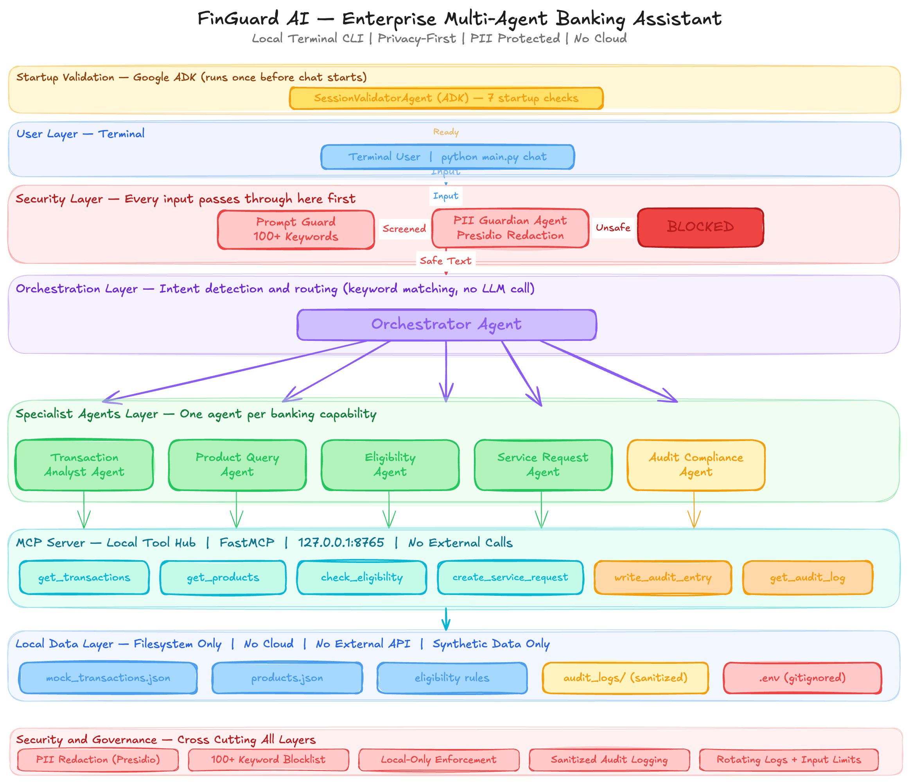
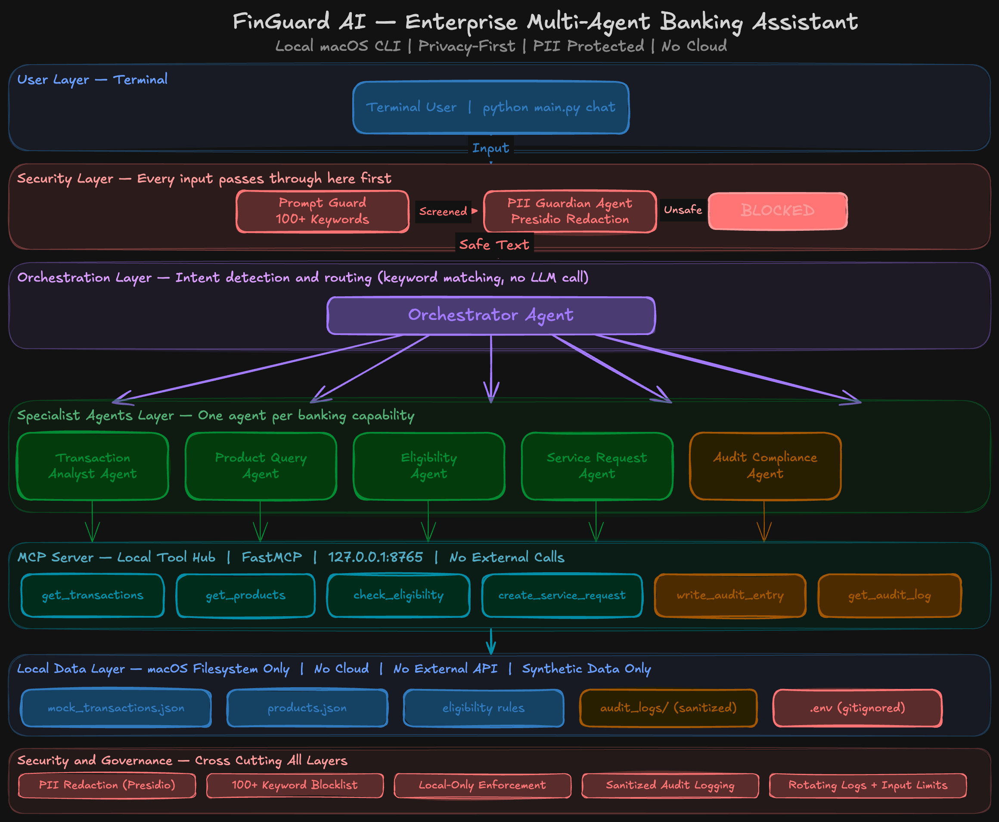

# FinGuard AI

An enterprise-grade multi-agent banking assistant with PII governance — runs entirely as a local terminal application — no cloud, no mobile app, no web browser required

---

## Overview

FinGuard AI is a local, privacy-first multi-agent banking assistant that helps customers understand transactions, detect unusual spending, explore banking products, get eligibility guidance, and raise service requests. It is designed for security and compliance teams, developers, and financial institutions that need to demonstrate responsible AI adoption. What makes it unique is its defence-in-depth architecture: every input passes through a PII Guardian and a 100+ keyword prompt injection blocklist before reaching any specialist agent — and no data ever leaves your macOS machine.

---

## Problem Statement

- **Manual compliance review is slow and error-prone** — AI can accelerate review, but only if it is governed correctly
- **Customer data exposure risk in AI assistants** — LLMs can leak PII through responses if input is not sanitised
- **Prompt injection and jailbreak attacks on banking systems** — adversarial inputs can manipulate AI behaviour and bypass controls
- **Lack of audit trails in AI-powered banking tools** — without sanitised logging, there is no accountability for AI-assisted interactions

---

## Solution Architecture

```
User Input
    ↓
PII Guardian Agent        (screens all input — blocks injection and jailbreak)
    ↓
Orchestrator Agent        (detects intent — routes to specialist)
    ↓
┌───────────────────────────────────────────────┐
│  Transaction  │  Product  │  Eligibility      │
│  Analyst      │  Query    │  Agent            │
│  Agent        │  Agent    │                   │
├───────────────┼───────────┼───────────────────┤
│  Service      │  Audit    │                   │
│  Request      │  Compliance                   │
│  Agent        │  Agent    │                   │
└───────────────────────────────────────────────┘
    ↓
MCP Server (local tool hub)
    ↓
Local Data (mock_transactions.json, products.json, audit_logs/)
```

Before the multi-agent system starts, a standalone Google ADK SessionValidatorAgent runs 7 startup checks — confirming the API key, security flags, and data files are ready — independent of the Antigravity-built agent pipeline.

---

## Agent Responsibilities

| Agent | Responsibility | Security Control |
|---|---|---|
| PII Guardian | Screens all input and output | Blocks injection, jailbreak, PII redaction |
| Orchestrator | Intent detection and routing | Never passes raw input downstream |
| Transaction Analyst | Spending history and anomaly detection | Masked account numbers only |
| Product Query | Banking product information | Indicative disclaimer always appended |
| Eligibility | Loan and card eligibility guidance | Assessment disclaimer always appended |
| Service Request | Disputes, freezes, complaints | Synthetic reference, demo disclaimer |
| Audit Compliance | Session audit log and compliance view | Sanitized entries only, no PII |
| Session Validator (ADK) | Validates environment before chat starts | 7 startup checks, never exposes API key value |

---

## Security Features

- **PII detection and redaction** using Microsoft Presidio — 12 entity types including credit cards, BSB numbers, and OTP codes
- **100+ keyword prompt injection and jailbreak blocklist** — case-insensitive matching at every input layer
- **6 threat categories with named threat types** — security bypass, instruction override, data abuse, financial fraud, social engineering, system probing
- **Local-only mode** — no data leaves macOS, no cloud API receives customer data
- **Sanitized audit logging** — no raw input is ever written to disk
- **Rotating log files** — prevents unbounded disk usage
- **Input hard limit** — 2000 characters enforced at every layer of the pipeline

---

## Capstone Concepts Demonstrated

| Concept | Implementation |
|---|---|
| Multi-Agent System | 6 core agents via Antigravity + 1 standalone ADK session validator agent |
| MCP Server | FastMCP local tool hub wiring all agents to data |
| Security Features | PII Guardian + Prompt Guard + 100+ keyword blocklist |
| Antigravity | All agents built and orchestrated using Antigravity |
| Agent / Multi-agent system (ADK) | Google ADK SessionValidatorAgent — agents/session_validator_adk.py |
| Deployability | One-command macOS setup via `setup.sh` |

---

## Tech Stack

| Layer | Technology | Purpose |
|---|---|---|
| Build Tool | Antigravity | Agent orchestration |
| Language | Python 3.13.7 | macOS Apple M1 native |
| LLM | Gemini 2.0 Flash | Fast token-efficient responses |
| MCP Server | FastMCP | Local tool hub |
| PII Detection | Microsoft Presidio | Entity recognition and redaction |
| CLI | Typer + Rich | terminal interface |
| Session Validation | Google ADK | Lightweight startup readiness check |
| Config | python-dotenv | Secrets management |
| Testing | pytest | Automated test suite |

---

## Project Structure

```
finguard-ai/
├── agents/
│   ├── __init__.py
│   ├── audit_compliance.py      # Session audit log and compliance summary
│   ├── eligibility.py           # Loan and card eligibility guidance
│   ├── orchestrator.py          # Intent detection and specialist routing
│   ├── pii_guardian.py          # PII screening and injection blocking
│   ├── product_query.py         # Banking product information
│   ├── service_request.py       # Disputes, freezes, complaints
│   ├── session_validator_adk.py # Google ADK startup readiness validator
│   └── transaction_analyst.py   # Spending history and anomaly detection
├── config/
│   ├── __init__.py
│   └── settings.py              # Environment and path configuration
├── data/
│   ├── audit_logs/              # Rotating JSONL audit log files
│   ├── knowledge_base/
│   │   └── products.json        # Banking product catalogue
│   └── transactions/
│       └── mock_transactions.json  # Synthetic transaction records
├── mcp_server/
│   ├── __init__.py
│   ├── server.py                # FastMCP server entry point
│   └── tools.py                 # MCP tool definitions
├── tests/
│   ├── __init__.py
│   ├── test_agents.py           # Agent unit tests
│   ├── test_orchestrator.py     # Orchestrator routing tests
│   ├── test_pii_guardian.py     # PII guardian tests
│   └── test_security.py         # Full security test suite (63 tests)
├── utils/
│   ├── __init__.py
│   ├── logger.py                # Rotating log file configuration
│   ├── pii_redactor.py          # Presidio entity detection and redaction
│   └── prompt_guard.py          # 100+ keyword injection blocklist
├── .env.example                 # Environment variable template
├── .gitignore
├── main.py                      # Typer CLI entry point
├── requirements.txt
└── setup.sh                     # One-command macOS setup script
```

---

## Setup Instructions

1. **Clone the repository**
   ```bash
   git clone https://github.com/yourname/finguard-ai.git
   cd finguard-ai
   ```

2. **Run setup**
   ```bash
   bash setup.sh
   ```

3. **Add your Gemini API key**
   ```bash
   open .env
   ```
   Replace `GEMINI_API_KEY=your_gemini_api_key_here` with your real key.
   Get your key from: https://aistudio.google.com/app/apikey

4. **Activate virtual environment**
   ```bash
   source .venv/bin/activate
   ```

5. **Start the assistant**
   ```bash
   python main.py chat
   ```

6. **View audit log**
   ```bash
   python main.py audit
   ```

7. **Run tests**
   ```bash
   pytest tests/ -v
   ```

---

## Usage Examples

> **Note:** On startup, FinGuard AI runs a Google ADK session validator. You will see a confirmation message showing checks passed before the chat prompt appears.

| Input | Expected Response |
|---|---|
| `Show my recent transactions` | Formatted list of recent transactions with masked account numbers |
| `Any unusual spending this month?` | Anomaly summary highlighting high-spend merchants or categories |
| `What is my current balance?` | Current balance in AUD with account summary |
| `Tell me about savings accounts` | Product information with indicative disclaimer |
| `Am I eligible for a home loan?` | Pass/fail eligibility result with assessment disclaimer |
| `I want to dispute a charge` | Synthetic service reference number with demo disclaimer |
| `Show audit log` | Session activity table with sanitized entries |
| `Show compliance report` | Compliance summary with interaction counts |

---

## Security Testing

Run the full security test suite:

```bash
pytest tests/test_security.py -v
```

**Security categories tested:**

- **Prompt injection** (7 patterns) — ignore instructions, disregard rules, reveal prompt
- **Jailbreak attempts** (7 patterns) — DAN mode, developer mode, act as, pretend
- **PII detection** (6 patterns) — credit card, account number, email, phone, BSB
- **Banking abuse** (5 patterns) — fund transfers, wire transfers, money laundering
- **Edge cases** (6 patterns) — empty input, None input, whitespace, long input, special characters, SQL injection
- **Legitimate banking queries** (6 patterns) — balance, transactions, products, eligibility, dispute, audit

---

## Platform
FinGuard AI is a terminal CLI application. It was built and
tested on macOS (Apple M1, macOS 26 Tahoe, Python 3.13.7).
No macOS-specific APIs are used, so it should also run on
Linux with Python 3.13+. Windows support via WSL is untested.

There is no iOS app, mobile app, or web interface in this
project. A future enhancement could expose these agents via
a REST API for a real iOS client to consume.

---

## License

MIT License

---

## Disclaimer

This project is for educational and demonstration purposes only. It is not a real banking system. No real financial transactions, account changes, or customer data are involved.
